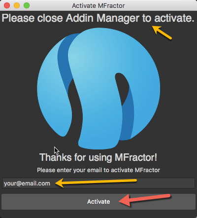
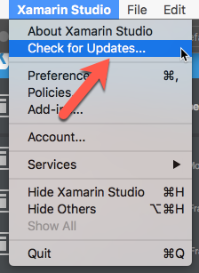

##Setup

*Installing, activating and updating MFractor*

##Introduction

This document covers how to install, activate, update and uninstall MFractor for Visual Studio Mac.

##Get MFractor
The latest version of MFractor for Visual Studio Mac can be downloaded from the addin server, [addins.mfractor.com/MFractor.mpack](http://addins.mfractor.com/MFractor.mpack).

If you'd like an older version of MFractor, these can be found under our old release archives. Simply navigate to [addins.mfractor.com/releases](http://addins.mfractor.com/releases), open the folder for the version you'd like and download the .mpack file.

## Install MFractor Manually

MFractor can be installed directly through the addin manager's **Install from file** button.

Firstly, download the latest version of MFractor for Visual Studio Mac at [addins.mfractor.com/MFractor.mpack](addins.mfractor.com/MFractor.mpack)

Open up Visual Studio Mac and click on the **Visual Studio Mac** menu and then **Addins...**

Within the Addin Manager, click the **Install from file** button in the bottom left of the Addin Manager.

Browse to **MFractor.mpack** and then select **Open**:

##Install Using MFractor.Installer
We can also install install MFractor into Visual Studio Mac by using the MFractor.Installer helper addin.

This addin lives inside the Addin Manager in Visual Studio Mac, under **Gallery** -> **IDE extensions**.

Open up Visual Studio Mac and click on the **Visual Studio Mac** menu and then **Addins...**

Once the Addin Manager opens, click **Gallery** and under **IDE extensions** locate **MFractor.Installer**. If this isn't present, hit the **Refresh** button to update the Gallery listings.

Once you've located **MFractor.Installer**, left click on it to select it. In the right hand detail view, click **Install**. Visual Studio Mac will prompt you for confirmation, click **Install**

You will then see a download dialog appear and MFractor will download and install.

##Activation

To use MFractor, you'll need activate it using your email address.

First things first, **close the Addin Manager**. There is a known bug that blocks the email entry field from receiving keyboard when the Addin Manager is open. It's a pain and we are working on fixing this.

To activate MFractor, enter you email and then click **Activate**.

Tada! You are now ready to rock. Why not learn how to use MFractor for [Xamarin.Forms](xamarin-forms-quickstart.md) or [Xamarin.Android](xamarin-android-quickstart.md) next?

##Updating

When MFractor installs into Visual Studio Mac, it'll register itself into Visual Studio Macs addin updater.

This means that Visual Studio Mac will automatically prompt you that an update is available.

However, you can check for udpate at any time by opening the **Visual Studio Mac** main menu and selecting **Check for Updates...**

Visual Studio Mac will check the MFractor addin server for updates and prompt you to update if there is a new version!

##Uninstalling MFractor

You can uninstall MFractor through the addin manager at any time.

Select the **Visual Studio Mac** main menu and then **Addins**

Under **Gallery** then **IDE extensions** select the MFractor addin list item and then click **Uninstall**

You will be prompted to uninstall the addin, confirm uninstallation by clicking **Uninstall**

