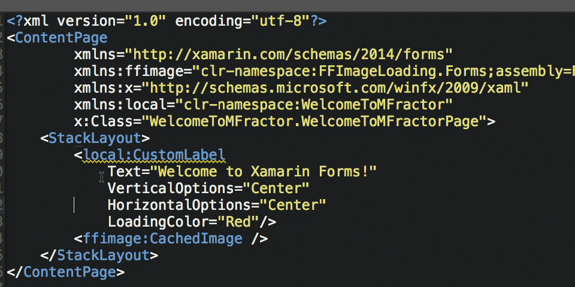

##Welcome

Hey there fellow Xamarin developer!

Welcome to the documentation for MFractor, the essential productivity tool for Xamarin Studio.

Have you ever...

 * Hit runtime issues so obvious you were scratching your head over why code analysis didn't pick it up?
 * Been frustrated by continuously writing the same boilerplate code?
 * Felt you're doing a LOT of text searching when a class **should** just be a keystroke away?

As a seasoned Xamarin developer, these problems bit me many times over the years... And they irked me so much that I started building MFractor to solve these issues.

MFractor gives you several features so you can make great apps faster:

 * A comprehensive code analyser turns runtime crashes into in-editor code warnings.
 * A code generation engine auto-magically creates boilerplate code in a few clicks instead of a few hundred keystrokes.
 * A few dozen of navigation improvements remove the friction of navigating your apps source code.

Slowly, I am building the ReSharper for Xamarin Studio and I'm thrilled that you have joined me on the journey.

If something doesn't work quite right or you'd like a sweet new feature added, be patient and contact me:

 * Via Twitter: Give me a holla at [@matthewrdev](https://twitter.com/matthewrdev)
 * Via Slack: Drop in to chat anytime in the [#mfractor Xamarin Slack sub-channel](https://xamarinchat.slack.com/archives/mfractor).
 * Via Email: Shot an email to hello@mfractor.com

Finally, thank you for installing and using MFractor. It means the world to me.

Matthew Robbins - Creator of MFractor. ✌️

##Introduction
MFractor is a comprehensive suite of productivity tools for Xamarin Studio to enable developers to make great apps faster.

**With MFractor for Xamarin.Forms, you can:**

Navigate from Xaml to C# faster with Xaml tooltips, go-to symbol and Mvvm shortcuts.

Write less Xaml bugs with a Xaml analyser detecting code issues at design time... Then fix those issue in just a few clicks.

Generate C# code from Xaml such as binding context properties, commands, bindable properties and much, much more.

**With MFractor for Xamarin.Android, you can:**

Navigate app resources fluently with resource tooltips, go-to resource declaration and find all reference support.

Quickly create xml resources with IntelliSense for **all** resource types (not just layouts).

Build bug free layouts and app resources with Android resource analysis.

Avoid Android specific runtime issues with C# code analysis.

In these docs, you'll learn how to install MFractor, use MFractor for Xamarin.Forms and use MFractor for Xamarin.Android. By the end of this documentation you'll be a master at leveraging MFractors feature suite to build great apps faster.

If you run into an issue along the way, support for MFractor is available via the following ways:
 - Tweet to @matthewrdev at any time on Twitter.
 - The Xamarin Slack channel has an #mfractor sub-channel. Drop in and chat.
 - Email hello@mfractor.com to contact support.

Let's get started by [Installing MFractor for Xamarin Studio](setup.md)
